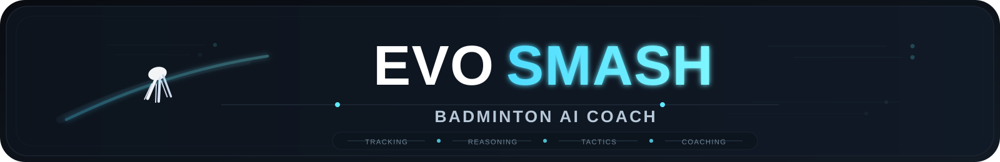
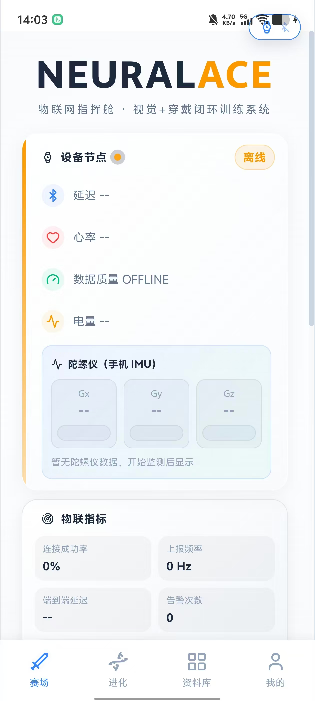
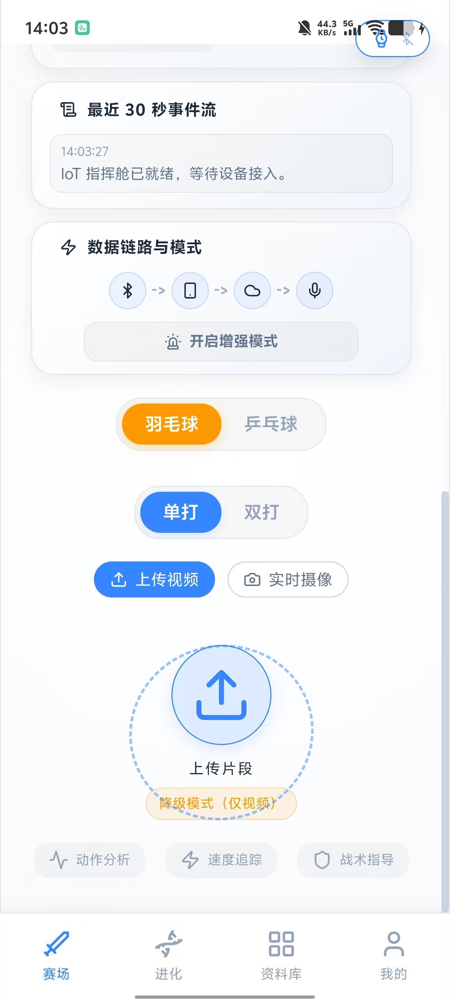
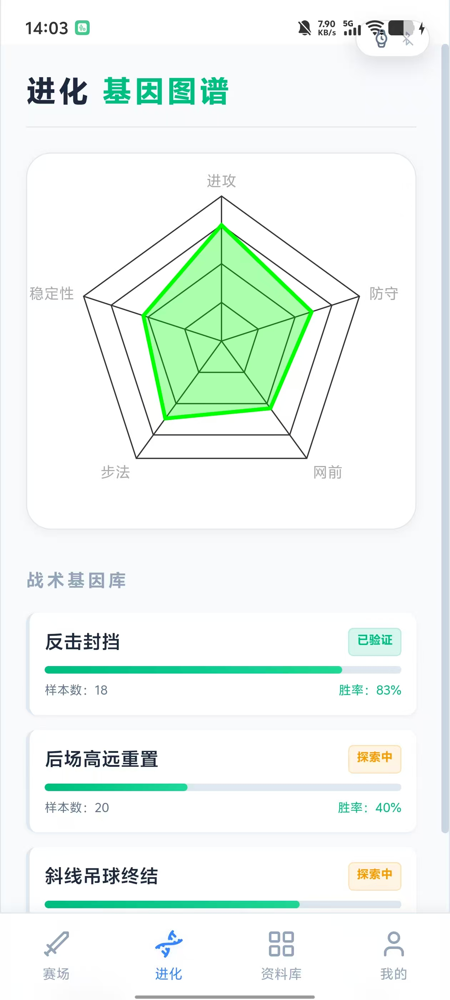
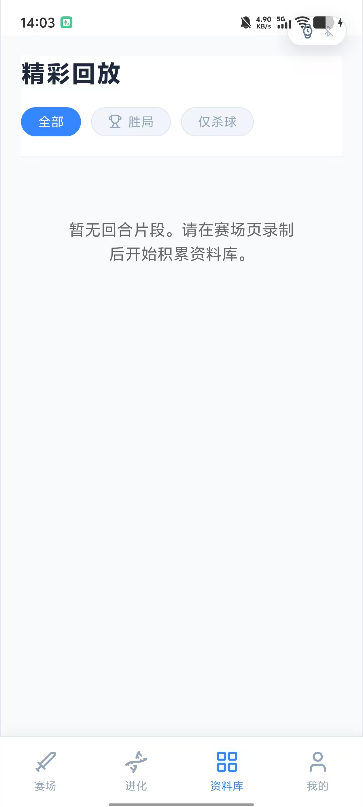
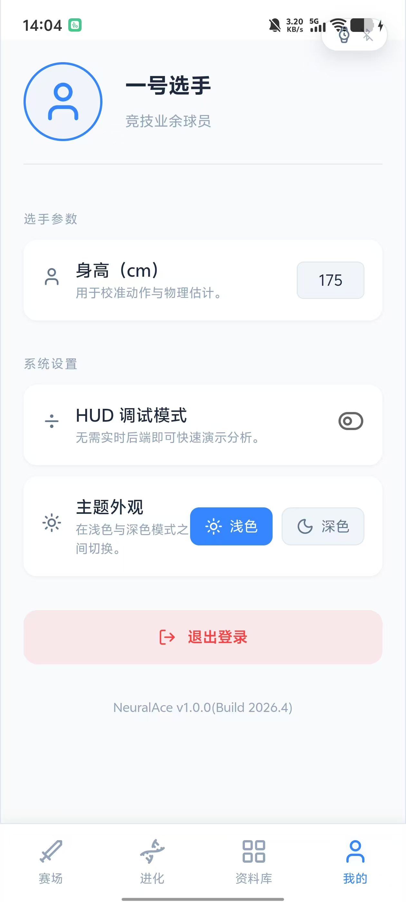
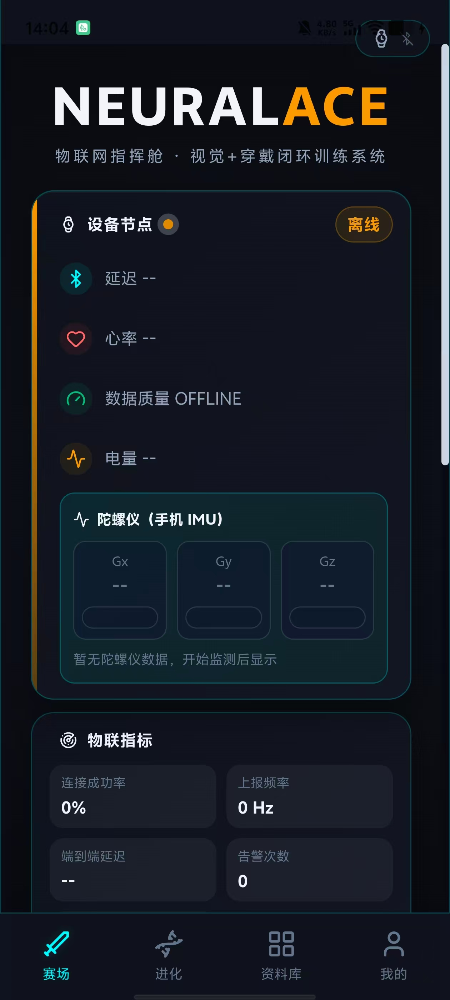
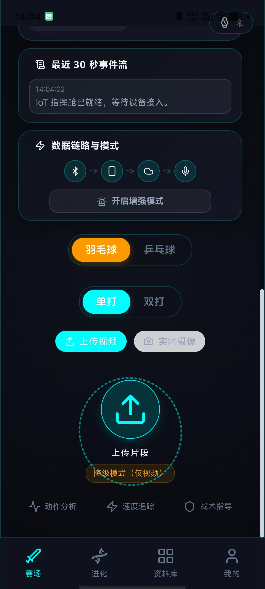

<div align="center">



### 智能羽毛球训练分析与物联网感知平台

`视频理解` · `轨迹分析` · `手环物联网` · `AI 教练反馈` · `移动端训练座舱`

</div>

---

## 项目简介

**NeuralAce** 是一个以羽毛球训练分析为核心的智能运动辅助系统。项目通过视频识别、轨迹推理、战术分析和可穿戴设备数据融合，将一次训练回合转化为可视化、可解释、可复盘的训练反馈。

系统重点面向羽毛球训练场景：用户可以上传回合视频或使用摄像头录制训练片段，后端会对球路、落点、动作状态、回合结果和战术建议进行综合分析；前端则以移动端 HUD 形式展示分析结果、训练状态和 AI 教练建议。 

在羽毛球主线之外，项目也加入了简化版乒乓球分析入口，用于扩展多运动识别能力和后续训练场景迁移。

---

## 核心亮点

### 羽毛球智能分析

- **回合视频解析**：支持上传视频或调用摄像头录制训练片段
- **球路轨迹识别**：对羽毛球飞行路径、速度变化和关键击球阶段进行分析
- **落点与结果判断**：结合场地信息和物理推理，对回合结果给出自动化判断
- **动作与压力反馈**：通过姿态、节奏和回合表现生成训练诊断
- **战术建议生成**：结合当前回合状态输出更适合训练复盘的策略建议

### 手环物联网训练座舱

项目将手环作为训练过程中的实时感知节点，把运动员的身体状态接入分析链路，形成“视频画面 + 运动数据 + AI 反馈”的闭环。

- **心率实时采集**：通过手环持续获取训练过程中的心率变化，用于判断运动负荷、恢复状态和训练强度
- **陀螺仪动作感知**：采集手环侧的陀螺仪数据，辅助捕捉挥拍、急停、转身和节奏波动等运动状态
- **训练强度监测**：将心率与惯性数据融合，构建实时训练状态面板
- **物联事件流**：记录设备连接、数据上报、状态变化和训练告警，便于展示完整的数据链路
- **边端云协同**：手环数据经移动端接入后，与云端视频分析结果联动，为 AI 教练提供更多上下文
- **实时告警反馈**：当身体状态波动明显或训练节奏异常时，可触发提示与建议

这一模块让系统不只是“看视频”，而是能够同时感知运动员的身体负荷、动作节奏和训练风险，更适合真实训练环境中的智能辅助与展示。

### 乒乓球扩展能力

- 提供乒乓球模式入口
- 支持基础视频分析流程复用
- 为后续多球类运动扩展预留接口

### 亮暗色主题切换

- 支持浅色与深色两种主题模式
- 深色模式采用赛博朋克风格，适合暗光环境与沉浸式展示
- 浅色模式采用简洁明亮风格，适合日常训练与户外使用
- 在个人设置页一键切换，全局即时生效

---

## 系统流程

```text
训练视频 / 实时录制
        ↓
视觉识别与轨迹提取
        ↓
物理推理与回合判断
        ↓
手环心率与陀螺仪数据融合
        ↓
战术分析与训练状态评估
        ↓
AI 教练建议与前端 HUD 展示
```

---

## 功能模块

### 赛场分析页

- 羽毛球 / 乒乓球模式切换
- 单打 / 双打模式切换
- 本地视频上传
- 摄像头实时录制
- 分析进度展示
- 回合结果、球速、落点、战术建议与诊断信息展示
- 手环物联网指挥舱展示
- 语音播报与音效反馈

### 物联网指挥舱

- 手环连接状态展示
- 心率数据展示
- 陀螺仪三轴数据展示
- 端到端延迟与数据质量监测
- 最近事件流记录
- 训练状态与告警提示
- 增强演示模式支持

### 进化分析页

- 能力雷达图
- 战术样本统计
- 胜率与策略适配展示

### 回放资料库

- 保存分析过的训练片段
- 支持按胜负或动作类型筛选
- 支持视频回看与复盘

### 个人设置页

- 亮色 / 深色主题切换
- HUD 调试模式开关
- 增强演示数据加载
- 本地数据管理

---

## 技术栈

### 前端

- React 19
- Vite
- React Router
- Framer Motion
- Recharts
- Lucide React
- React Webcam
- Capacitor Android

### 后端

- FastAPI
- PyTorch
- OpenCV
- Ultralytics YOLO
- WebSocket
- Pydantic

---

## 快速开始

### 1. 启动后端

```bash
cd backend
python -m venv venv
```

Windows:

```bash
.\venv\Scripts\activate
```

macOS / Linux:

```bash
source venv/bin/activate
```

安装依赖并启动服务：

```bash
pip install -r requirements.txt
python main.py
```

> **LLM 配置**：AI 教练功能依赖 LLM API，需在 `backend/` 目录下创建 `.env` 文件（参考 `.env.example`）配置 `LLM_API_KEY`、`LLM_BASE_URL` 和 `LLM_MODEL_NAME`。若未配置，AI 教练将使用默认回退逻辑。

后端默认运行在：

```text
http://localhost:8000
```

### 2. 准备模型文件

将模型权重放入 `backend/checkpoints/`：

羽毛球分析模型：

```text
TrackNet_best.pt          # 羽毛球轨迹识别
InpaintNet_best.pt        # 轨迹修复网络
yolov8n-pose.pt           # 姿态估计
```

乒乓球分析模型：

```text
tracknetv2_midpoint_best.pt   # 乒乓球轨迹识别
```

### 3. 启动前端

```bash
npm install
npm run dev
```

前端默认访问地址：

```text
http://localhost:5173
```

### 4. 构建 Android 应用

```bash
npm run build
npx cap sync
npx cap open android
```

在 Android Studio 中选择目标设备并点击 Run 安装到手机。

> **手机端测试注意**：手机需与电脑在同一局域网，且后端地址需使用电脑的局域网 IP（而非 `localhost`）。详见下方运行注意事项。

---

## 接口说明

### `GET /health`

检查后端服务及核心模块状态。

### `POST /analyze_rally`

分析单个训练回合视频，返回球路、结果、战术建议、AI 教练反馈和诊断信息。

参数：

- `file`：训练视频文件
- `match_type`：`singles` 或 `doubles`
- `sport_type`：`badminton` 或 `table_tennis`

### `POST /analyze_match`

分析较长视频片段，自动拆分多个回合并生成结构化分析结果。

### `POST /feedback`

提交人工反馈，用于更新战术评估结果。

### `WebSocket /ws/wearable`

接收手环物联网数据流，包括心率、陀螺仪与训练状态相关数据，并返回实时状态评估或告警信息。

### `GET /wearable/state`

获取当前训练状态与身体负荷评估结果。

---

## 项目结构

```text
NeuralAce/
├─ src/
│  ├─ components/      # 通用组件与物联网 HUD
│  ├─ context/         # 全局训练状态
│  ├─ pages/           # Arena、Evolution、Library、Profile 页面
│  ├─ styles/          # 页面样式
│  └─ utils/           # API、音效、语音播报等工具
├─ backend/
│  ├─ core/
│  │  ├─ vision/       # 视觉识别与轨迹追踪
│  │  ├─ physics/      # 物理推理与回合判断
│  │  ├─ memory/       # 战术记忆与策略检索
│  │  └─ agent/        # AI 教练与手环训练状态分析
│  ├─ services/        # 分析服务编排
│  ├─ schemas/         # 接口数据结构
│  ├─ checkpoints/     # 模型权重
│  ├─ db/              # 本地数据文件
│  └─ main.py          # FastAPI 入口
├─ android/            # Capacitor Android 工程
├─ assets/             # 图片与展示资源
└─ README.md
```

---

## 使用场景

- 羽毛球训练视频复盘
- 训练强度与心率监测展示
- 挥拍节奏与身体状态辅助判断
- 移动端运动分析 Demo
- 物联网运动健康系统展示
- 多模态 AI 体育训练平台原型

---

## 后续优化方向

- 提升复杂场景下的羽毛球轨迹识别稳定性
- 完善手环数据与视频事件的时间同步
- 增强陀螺仪动作模式识别能力
- 扩展乒乓球分析指标
- 支持更多可穿戴设备接入
- 优化移动端实时训练体验

---

## 界面预览

<table align="center">
  <tr>
    <td align="center" width="14%">
      
    </td>
    <td align="center" width="14%">
      
    </td>
    <td align="center" width="14%">
      
    </td>
    <td align="center" width="14%">
      
    </td>
    <td align="center" width="14%">
      
    </td>
    <td align="center" width="14%">
      
    </td>
    <td align="center" width="14%">
      
    </td>
  </tr>
</table>

---

## 手环物联网数据链路

手环模块是本项目的重点增强部分。系统将手环视为运动员身上的实时传感器，通过心率与陀螺仪数据补充单纯视频分析难以获得的身体状态信息。

```text
手环传感器
  ├─ 心率数据：训练强度、恢复状态、身体负荷
  └─ 陀螺仪数据：挥拍节奏、身体转动、运动姿态变化
        ↓
移动端数据接入
        ↓
WebSocket 实时传输
        ↓
后端训练状态评估
        ↓
前端物联网指挥舱展示
        ↓
AI 教练综合反馈
```

### 数据价值

- **训练负荷可视化**：通过心率变化展示运动员从热身、对抗到恢复的状态变化
- **动作节奏感知**：通过陀螺仪捕捉挥拍、转体、急停和连续移动带来的动态变化
- **风险提前提示**：当身体状态异常波动时，系统可生成提醒，辅助训练安全管理
- **多模态融合分析**：将视频中的球路表现与手环中的身体数据结合，让训练反馈更完整
- **展示效果增强**：前端以物联网指挥舱形式呈现设备状态、数据质量、事件流和训练告警，更适合移动端演示与现场讲解

---

## 推荐演示流程

1. **进入赛场分析页**
   - 选择羽毛球模式
   - 根据场景选择单打或双打

2. **连接手环设备**
   - 展示手环连接状态
   - 观察心率、陀螺仪、延迟和数据质量变化

3. **上传或录制训练视频**
   - 使用短回合视频进行快速分析
   - 等待后端返回识别和诊断结果

4. **查看 AI 分析结果**
   - 查看回合结果、球速、落点和战术建议
   - 结合手环数据观察训练负荷与动作节奏

5. **进入回放和进化页面**
   - 查看训练片段沉淀
   - 展示能力雷达图和战术样本变化

---

## 运行注意事项

- 后端服务默认运行在 `http://localhost:8000`（绑定 `0.0.0.0`，可被局域网访问）
- 前端开发服务默认运行在 `http://localhost:5173`
- 视频分析依赖模型权重文件，请确认 `backend/checkpoints/` 下已放置对应模型（羽毛球 + 乒乓球）
- 摄像头录制功能需要浏览器授权摄像头权限
- Android 端需要先执行 `npm run build` 和 `npx cap sync`
- 手环物联网功能需要设备连接和数据通道正常工作
- 如果只进行界面演示，可使用增强演示模式展示物联网状态变化
- 语音播报功能使用浏览器 Web Speech API，需浏览器支持

### 手机端测试额外要求

- 手机与电脑必须在同一局域网下
- 前端 API 地址需从 `localhost` 改为电脑的局域网 IP（如 `http://192.168.x.x:8000`）
- Android 端已配置 `usesCleartextTraffic` 和 Capacitor `server.cleartext` 以允许 HTTP 明文请求
- Windows 防火墙需放行后端端口（默认 8000）的入站 TCP 连接
- 修改前端地址后需重新执行 `npm run build` + `npx cap sync` 并重装应用

---

## 项目定位

本项目不是单一的视频识别 Demo，而是面向羽毛球、乒乓球等多球类训练场景构建的多模态物联网智能分析系统。它将比赛画面、球路变化、身体状态、战术建议、物联网终端和移动端交互整合在一起，让训练过程从“看见结果”进一步升级为“理解过程、感知状态、辅助决策”。

乒乓球能力作为轻量扩展模块保留在系统中，用于展示平台的多运动迁移潜力；羽毛球分析与手环物联网融合则是当前项目的核心展示方向。
